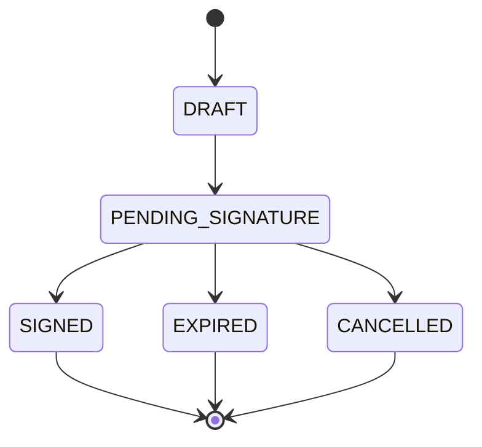
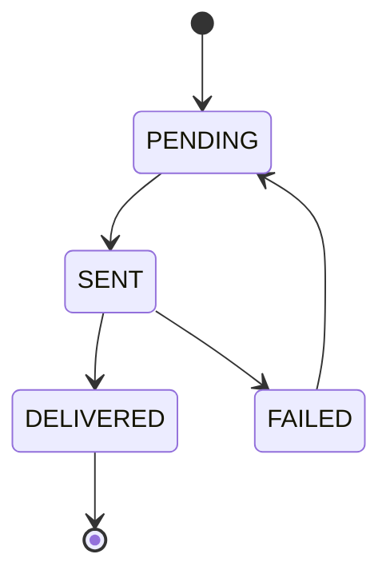

# Fluxos de Negócio

## 📋 Visão Geral

Este documento descreve os principais fluxos de negócio do sistema, incluindo:
- Cadastro de vendedor
- Criação de contrato
- Fluxo de assinatura
- Notificações
- Webhooks

## 🔄 Fluxos Principais

### 1. Cadastro de Vendedor

#### Fluxo Normal
1. Recebe dados do vendedor (CNPJ, email, telefone)
2. Valida formato do CNPJ
3. Consulta Brasil API para validação
4. Verifica se vendedor já existe:
   - Se existe: atualiza dados
   - Se não existe: cria novo registro
5. Envia notificação de boas-vindas
6. Retorna dados do vendedor

#### Tratamento de Erros
- CNPJ inválido: retorna erro 400
- API indisponível: retorna erro 503
- Vendedor já existe: retorna dados existentes
- Falha na notificação: registra erro

### 2. Criação de Contrato

#### Fluxo Normal
1. Recebe dados do contrato (vendedor, template)
2. Valida dados do vendedor
3. Obtém template ativo
4. Substitui variáveis no template
5. Cria registro do contrato
6. Upload para Autentique
7. Envia para assinatura
8. Agenda primeira notificação
9. Retorna dados do contrato

#### Tratamento de Erros
- Vendedor inválido: retorna erro 400
- Template inválido: retorna erro 400
- Falha no upload: retorna erro 500
- Falha na assinatura: retorna erro 500

### 3. Fluxo de Assinatura

#### Fluxo Normal
1. Contrato criado e enviado para assinatura
2. Sistema agenda primeira notificação
3. Envia notificação via WhatsApp
4. Se não assinar em 5 dias:
   - Agenda nova notificação
   - Incrementa contador
5. Máximo de 5 tentativas
6. Após assinatura:
   - Atualiza status
   - Notifica vendedor
   - Armazena documento

#### Tratamento de Erros
- Falha na notificação: agenda retry
- Excesso de tentativas: marca como expirado
- Falha no download: agenda retry
- Erro na atualização: registra erro

### 4. Notificações

#### Fluxo Normal
1. Sistema identifica necessidade de notificação
2. Valida dados do vendedor
3. Formata mensagem
4. Envia via WhatsApp
5. Registra tentativa
6. Atualiza status

#### Tratamento de Erros
- Falha no envio: agenda retry
- Número inválido: marca como falha
- Rate limit: agenda para depois
- Erro na API: registra erro

### 5. Webhooks

#### Fluxo Normal
1. Recebe webhook do Autentique
2. Valida assinatura
3. Identifica contrato
4. Atualiza status
5. Notifica vendedor
6. Retorna 200

#### Tratamento de Erros
- Assinatura inválida: retorna 401
- Contrato não encontrado: retorna 404
- Erro na atualização: retorna 500
- Timeout: agenda retry

### 6. CI/CD e Deploy

#### Fluxo de Deploy
1. Commit no repositório é detectado pelo Cloud Build
2. Pipeline `cloudbuild.yaml` é iniciado
3. Build da imagem Docker e push para Artifact Registry
4. Deploy no Cloud Run com secrets e recursos configurados
5. Health check verifica o status da aplicação
6. Rollback automático em caso de falha

#### Fluxo de Migração
1. Modificações na estrutura do banco são detectadas
2. Pipeline `cloudbuild-migration.yaml` é acionado
3. Definição do job `pricing-migration-job` é atualizada
4. Job é executado com recursos dedicados (2GB RAM, 2 CPUs)
5. Script `prisma-migrate.ts` executa a migração
6. Conexão com o banco é verificada após migração
7. Logs são enviados para o Cloud Logging

#### Prioridades do Pipeline
- Segurança: uso de secrets e service accounts
- Separação de responsabilidades: deploy e migração isolados
- Confiabilidade: health checks e retry automatizados
- Observabilidade: logs detalhados para diagnóstico

## 📊 Estados

### Contrato

### Notificação

## 📝 Regras de Negócio

### Vendedor
1. CNPJ deve ser único
2. Email deve ser válido
3. Telefone deve ser válido
4. Dados devem ser atualizados periodicamente

### Contrato
1. Deve ter vendedor válido
2. Deve usar template ativo
3. Prazo de assinatura: 15 dias
4. Máximo de 5 notificações

### Notificação
1. Intervalo entre tentativas: 5 dias
2. Horário de envio: 9h-18h
3. Formato de mensagem padronizado
4. Tracking obrigatório

### Webhook
1. Validação de assinatura obrigatória
2. Timeout de 5 segundos
3. Máximo de 3 retries
4. Log de todas as tentativas

## 🔍 Monitoramento

### Métricas
- Tempo médio de assinatura
- Taxa de sucesso nas notificações
- Tempo de resposta dos webhooks
- Erros por tipo

### Alertas
- Falha na API do WhatsApp
- Excesso de tentativas
- Webhooks falhando
- Contratos expirando

### Logs
- Todas as transições de estado
- Erros e exceções
- Tentativas de retry
- Webhooks recebidos
